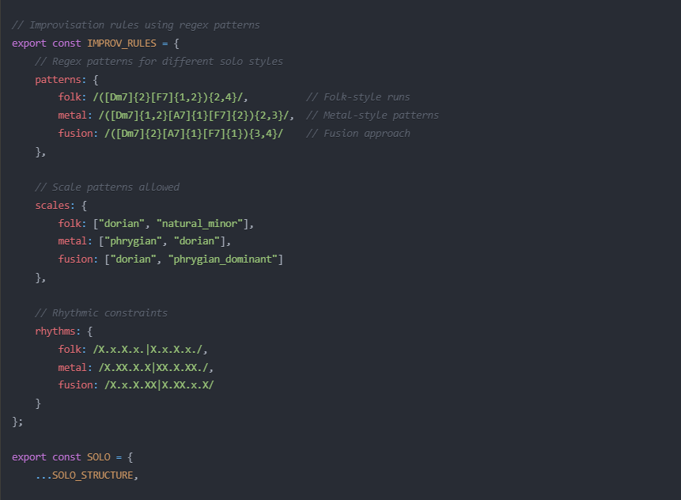
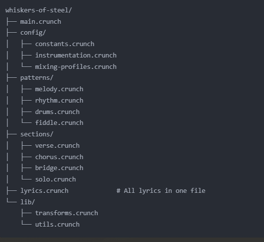

# Crunchy
So what you're seeing here is the solution to a problem in ai training.
First, let's explain the issue, and the ramifications of the solution.

Problem Statement: You can't build an ai system that has a functional understanding of music theory and orchestration, because of the way music notation works. If you could, people would be doing it already. 

The way we hack together music ai today is sloppy. Doing it from conversations, music artifacts (read copyright infringement), using diffusion processes. These solutions are stupid, and brutal, and it's like throwing a hammer at a window trying to solve the problem.

What's the problem? The problem is music notation. Music notation is centuries old, hasn't had an upgrade, and was designed to be visual. But, truth be told, even humans have trouble understanding it. For a long time, it was the best we had.

No more. It's time to do the obvious thing and start building out music compositions as code. This solves the problem of AI training for music, but more than that... it opens up a world of unexpected possibilities for music composition itself.

Enter... the concept of smart music!

By absorbing the rules of music notation, dropping them into a programming language that's easy for both humans and machines to read and understand, and adding logical structures and operators... we can cross compile sheet music into code, make the code do logical operations, based on criteria we set, including improv, and export it back out into sheet music. 

Imagine a composition that knows if it's being played live or in the studio, that can shift genres on a dime, adjust for surprises, change the number of performers, that accounts for vocal synthesis, and can jam like a crazy person with you at 3am.

Y'know, what's funny about this is, is that you don't even need ai to do this.
It's all procedural. And we can do it today.

We do need a new programming language to do it though.
Good news is that programming languages aren't hard to write.

I'm calling the system... Crunchy.
A two way music to logic and back again cross compiler.
It's going to be free and open source.

Wrecklessly untested coding examples, and a prototype will be forthcoming.
