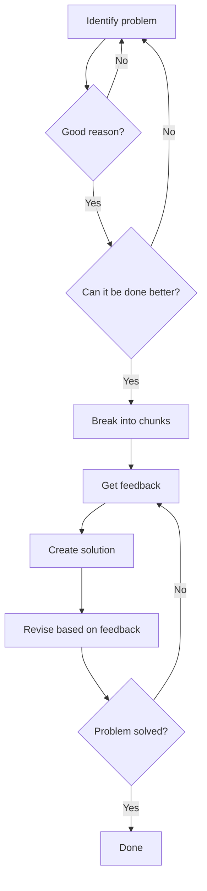

# Lynn's Problem Solving Process 

Lynn's problem solving approach:

1. Identify if there is a valid problem that needs solving
2. Determine if the current solution can be improved 
3. Break the problem down into manageable chunks
4. Iteratively get feedback, create solutions, and revise until the problem is resolved

This process ensures problems are well-defined and broken down before diving into solutioning. The feedback loop allows for continuous improvement and validation that the problem is being solved adequately.