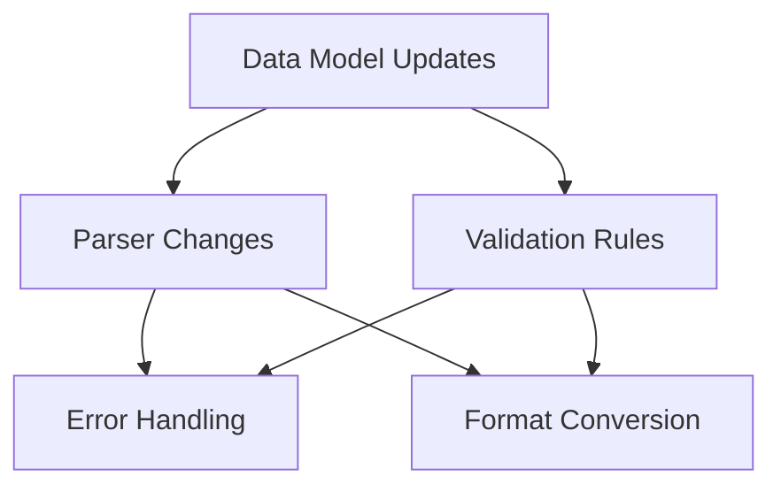

# Cultural and Regional Integration Change Tracking

## Data Model Specification Changes

### Required Updates
1. Instrument Definition Schema
   - Add regional metadata
   - Cultural context fields
   - Data confidence markers
   - Source attribution

2. Tuning Systems
   - Support for microtonal systems
   - Regional tuning variants
   - Conversion mappings
   - Default tuning confidence levels

3. Playing Techniques
   - Regional technique definitions
   - MPE mappings
   - Cultural context preservation
   - Technique equivalency mappings

### Impact Areas
- modular-model-spec.md: Add cultural context section
- instrument definition files
- MPE mapping configurations
- Validation rules

## Transpiler Specification Changes

### Required Updates
1. Parser Modifications
   - Non-Western notation support
   - Regional variant handling
   - Technique preservation
   - Cultural metadata parsing

2. Error Handling
   - Cultural-specific validation
   - Notation system conflicts
   - Technique mapping errors
   - Data confidence warnings

3. Conversion Logic
   - Cross-cultural notation mapping
   - Technique preservation rules
   - Tuning system conversions
   - MPE parameter mapping

### Impact Areas
- transpiler-spec.md: Add cultural handling
- Error handling specification
- Format conversion rules
- Validation system

## Implementation Priorities

1. Phase 1: Western Foundation
   - Complete Western instrument definitions
   - Basic MPE mapping structure
   - Core validation rules

2. Phase 2: Non-Western Integration
   - Add documented non-Western instruments
   - Implement regional variations
   - Expand validation rules

3. Phase 3: Expert Review System
   - Data confidence tracking
   - Expert input framework
   - Validation system expansion

## Dependency Graph

## Quality Assurance

1. Data Validation
   - Cultural accuracy checks
   - Technical correctness
   - Conversion accuracy
   - MPE mapping validation

2. Documentation Updates
   - Cultural context guidelines
   - Implementation notes
   - API documentation
   - Error message updates

## Known Gaps

1. Data Coverage
   - Missing regional variants
   - Incomplete technique mappings
   - Limited microtonal data

2. Technical Implementation
   - Complex tuning conversions
   - Regional technique preservation
   - Cross-cultural notation mapping

## Next Steps

1. Immediate Actions
   - Update schema documents
   - Modify parser specifications
   - Revise error handling

2. Review Points
   - Cultural accuracy checkpoints
   - Technical validation stages
   - Documentation updates

3. Future Considerations
   - Expert review system
   - Data expansion framework
   - Validation enhancement