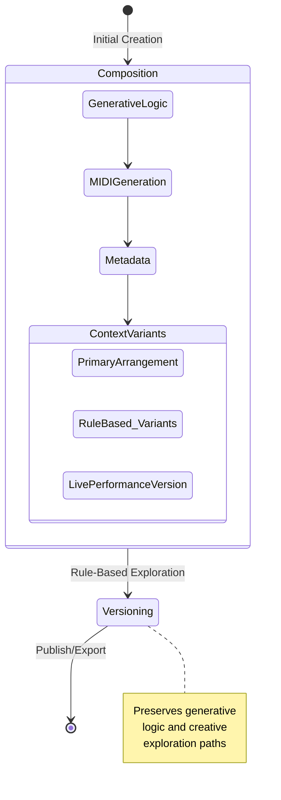

# DNA File Format Specification v0.2

## Overview
The DNA (Digital Notation Archive) file format is a comprehensive, intelligent container for musical compositions that preserves generative context, performance adaptability, and creative evolution.

## Supported Functions

### Composition Management
- `$dna->track()`: Select or list available track variants
- `$dna->rollback()`: Revert to a previous compositional state
- `$dna->fork()`: Create a new variant from the current composition

### Generative Context
- `$dna->get_rules()`: Retrieve current generative rules
- `$dna->set_rules()`: Modify generative composition rules
- `$dna->analyze_context()`: Evaluate current performance context

### Labeling and Metadata
- `$dna->label()`: Add, modify, or retrieve labels for specific versions or tracks

### Versioning
- `$dna->list_versions()`: Show all saved compositional states
- `$dna->compare_versions()`: Diff between different compositional states

### Export and Interchange
- `$dna->export()`: Convert to various musical formats
- `$dna->import()`: Integrate external musical data

## Disaster Recovery and Error Handling

### File Integrity
- Comprehensive checksum mechanism
- Ability to detect and attempt recovery of partially corrupted files

### Recovery Strategies
```
Potential recovery workflow:
1. Detect file corruption
2. Attempt partial state reconstruction
3. Retrieve most recent valid compositional state
4. Provide clear, actionable error information to user
```

#### Specific Recovery Scenarios
- Interrupted generative process
- Incomplete track variants
- Metadata corruption
- MIDI data integrity issues

### Error Reporting
- Human-readable error messages
- Contextual information about failure point
- Suggestions for potential resolution

## Interoperability

### DAW Integration
- VSTi plugin as primary integration method
- Targeting compatibility with:
  - Ableton Live
  - Logic Pro
  - FL Studio
  - Reaper
  - Bitwig Studio

### Format Translation
- Lossless conversion between:
  - MIDI
  - Native DNA format
  - Generative rule sets

## Technical Specification Approach

### Specification Methodology
- Behavior-driven specification
- Focus on interaction model
- Reference implementation in Crunchy system

### Key Specification Principles
- Flexibility over rigid implementation
- Preserve creative intent
- Minimize technical overhead

## Workflow Visualization



## Just Imagine...

You're a musician with a song that needs to exist in multiple forms. The radio edit needs to be tight and three-and-a-half minutes long. The live version needs space for improvisation. The studio recording might have a completely different set of generative rules.

Tracks solve this by letting you maintain those variations within a single musical artifact, preserving the core generative logic while allowing contextual flexibility.

## Philosophical Framework

### Provenance: A Creative Tool, Not a Constraint

The DNA file format's provenance tracking is fundamentally designed to empower artistic creativity, not to restrict or monetize musical work.

#### Core Principles
- Artistic Transparency
- Open Creative Exploration
- Collaborative Musical Intelligence

## Implementing the DNA Standard

### Minimum Viable Implementation
- Ability to store multiple musical variants
- Preserve generative context
- Support lossless rollback
- Implement core DNA functions
- Compression using LZMA
- Embedded metadata tracking

### Community Guidelines
- Prioritize musical creativity over technical complexity
- Maintain compatibility across different musical systems
- Keep the generative context portable
- Respect the open-source philosophy of musical exploration

### Contribution
Interested in developing or extending the standard? 
- Join the project repository
- Propose improvements through standard open-source collaboration methods
- Focus on solving real musical composition challenges
