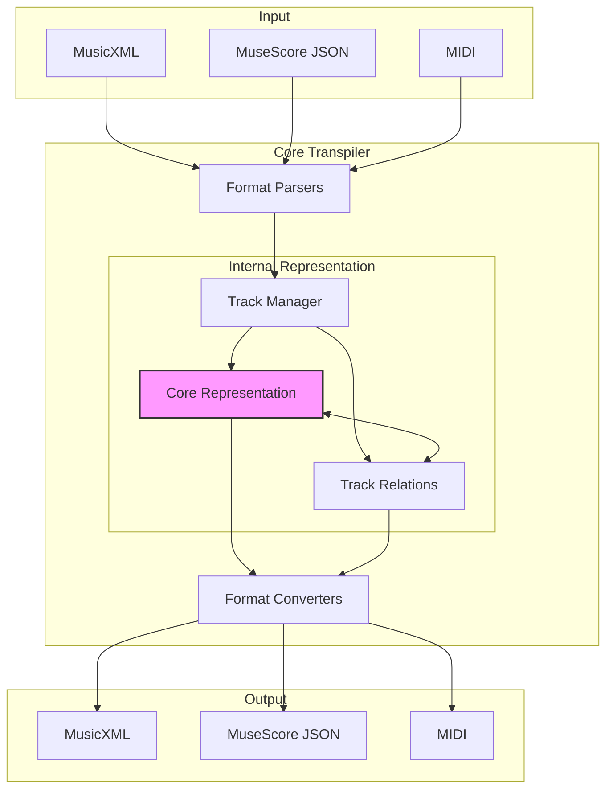
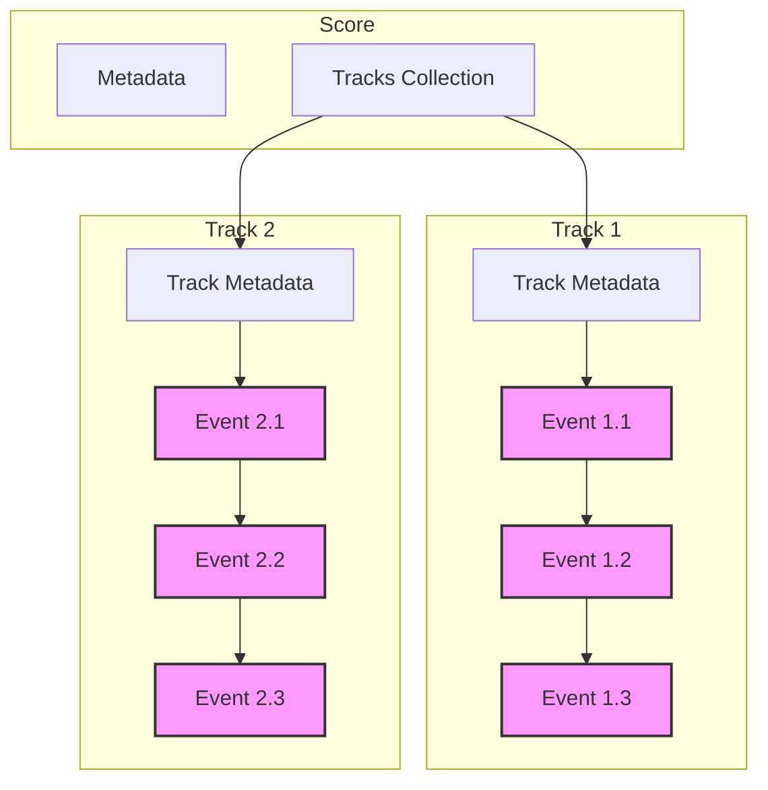

# Music Notation Transpiler: Design and Analysis
## A Technical Discussion and Invitation for Dialogue

## Introduction

This document explores approaches to representing musical notation in a transpiler system. While we present our analysis and chosen direction, we actively encourage constructive critique and alternative viewpoints. Our goal is to create a solid foundation for music notation conversion that is both practical and forward-thinking.

## The Core Challenge

Converting between music notation formats requires us to solve several fundamental problems:
- Preserving all musical meaning
- Handling both traditional and experimental notation
- Maintaining convertibility between formats
- Supporting multi-track compositions
- Scaling effectively
- Remaining maintainable

## Representation Approaches

### 1. Event-Based Network

An event-based approach treats musical elements as discrete events in time, connected by relationships.

```
Event{
    timing: TimePoint
    type: EventType
    properties: Map<String, Value>
    relationships: List<Relationship>
}
```

#### Advantages:
- Natural representation of temporal relationships
- Flexible property system
- Clear handling of simultaneous events
- Good fit for streaming processing

#### Challenges:
- Complex relationship management
- Memory overhead for relationship tracking
- Potential performance issues with large scores
- Complexity in maintaining format-specific details

### 2. Layered Representation

Separates musical information into distinct layers: raw events, relationships, and notation-specific details.

```
BaseLayer{
    events: List<MusicalEvent>
}

RelationshipLayer{
    connections: Map<EventId, List<Relationship>>
}

NotationLayer{
    formatSpecific: Map<EventId, FormatDetails>
}
```

#### Advantages:
- Clean separation of concerns
- Easier format-specific handling
- Clear upgrade path
- Simpler validation per layer

#### Challenges:
- Synchronization between layers
- Complexity in cross-layer relationships
- Potential redundancy

### 3. Graph-Based Structure

Represents music as a directed graph of musical elements with typed relationships.

```
Node{
    type: ElementType
    properties: Map<String, Value>
}

Edge{
    type: RelationType
    properties: Map<String, Value>
}
```

#### Advantages:
- Natural representation of musical relationships
- Strong querying capabilities
- Flexible structure for complex notation

#### Challenges:
- More complex implementation
- Potentially higher memory usage
- Need for careful edge type design

## Our Chosen Approach: Hybrid Event-Graph Structure

After analyzing these approaches, we're implementing a hybrid structure that combines event-based timing with graph-like relationships.

### Core Structure
```cpp
struct MusicalEvent {
    TimePoint timing;
    EventType type;
    Properties props;
    vector<Relationship> relations;
};
```

### System Architecture



## Multi-Track Support



## Error Handling
Our error handling prioritizes clear communication in musical terms. Rather than exposing technical details, errors are expressed in language that makes sense to musicians. For example:

"Track synchronization issue:
- Piano part ends at measure 45
- Violin part ends at measure 43
- All parts must have the same length"

See Error Handling Specification for complete details.

## Implementation Approach

### Key Design Decisions
1. Event-based foundation with graph-like relationships
2. Comprehensive track support
3. Clean error handling
4. Clear interfaces for format handling

### Testing Strategy
1. Unit tests for each component
2. Integration tests for format conversion
3. Validation with real-world scores
4. Edge case testing

## Areas Where We Welcome Feedback

1. **Musical Representation**
- How should we handle experimental notation?
- What edge cases need special consideration?
- Are there musical concepts that don't fit this model?

2. **Technical Approach**
- Are there more efficient ways to represent relationships?
- How could the property system be improved?
- What performance optimizations should we consider?

## Next Steps

1. Implementation of core structure
2. Basic format parser development
3. Test suite creation
4. Format converter implementation

## Invitation for Critique

We actively encourage constructive criticism of this approach. If you see limitations, have alternative suggestions, or spot potential issues, please share them. This project aims to serve the broader music community, and your insights are valuable in shaping its development.

[Project details and contribution guidelines to be added]
